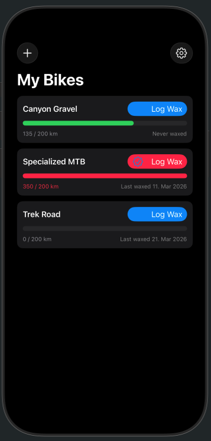
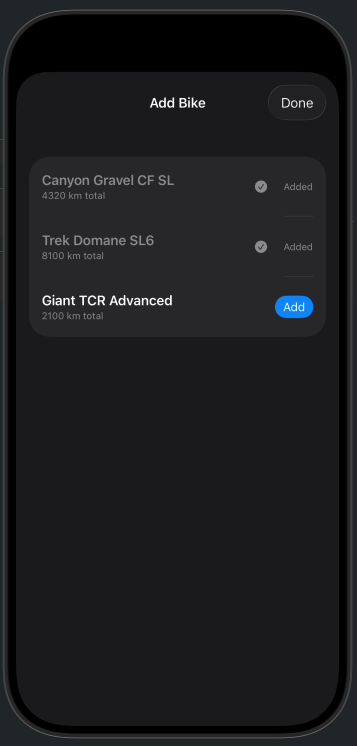
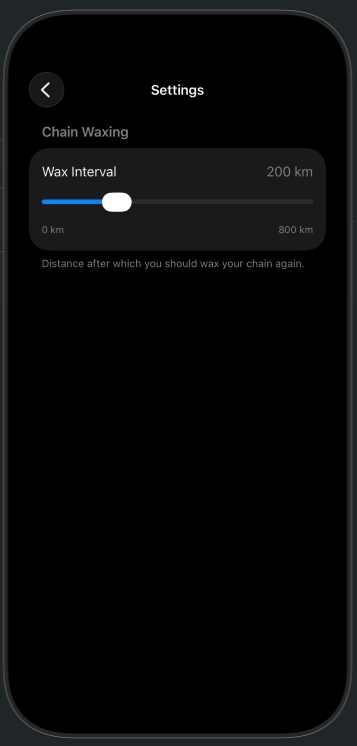

# BikeChain

BikeChain is an iOS app that helps cyclists track when their bike chains need waxing. It connects to your Strava account to automatically count the kilometers ridden since the last wax and alerts you when it's time to wax again.

## Features

- **Bike list** — all your bikes in one view, each with a live wax-status progress bar
- **Wax status** — shows kilometers ridden since last wax vs. your configured wax interval, color-coded green → red as the limit approaches
- **Log wax** — tap the *Log Wax* button on any bike to record a new waxing event instantly
- **Strava sync** — pull down to refresh ridden kilometers from Strava for all bikes
- **Import bikes** — add bikes directly from your Strava account via the + button
- **Configurable interval** — set your preferred wax interval (0–800 km) in Settings

## Screenshots

| Bike list | Add bike from Strava | Settings |
|-----------|----------------------|----------|
|  |  |  |

> Screenshots will appear here once the app is running on a device or simulator.

## Requirements

- Xcode 16 or later
- iOS 18 or later
- A [Strava account](https://www.strava.com) with at least one bike registered
- A Strava API application (free, see setup below)

## Setup

### 1. Clone the repository

```bash
git clone https://github.com/your-username/BikeChain.git
cd BikeChain
```

### 2. Create a Strava API application

1. Go to [strava.com/settings/api](https://www.strava.com/settings/api) and create a new application.
2. Set the **Authorization Callback Domain** to `localhost`.
3. Note your **Client ID** and **Client Secret** from the application page.
4. Find your **Athlete ID** — it appears in the URL when you view your own Strava profile:
   `https://www.strava.com/athletes/YOUR_ATHLETE_ID`

### 3. Configure credentials

Copy the example config file and fill in your values:

```bash
cp Config.xcconfig.example Config.xcconfig
```

Open `Config.xcconfig` and replace the placeholders:

```
STRAVA_CLIENT_ID     = 12345
STRAVA_CLIENT_SECRET = abc123def456...
STRAVA_ATHLETE_ID    = 9876543
```

> `Config.xcconfig` is listed in `.gitignore` and will never be committed to the repository.

### 4. Open and run

Open `BikeChain.xcodeproj` in Xcode, select a simulator or device, and hit **Run** (Cmd+R).

On first launch, tap **+** to import your bikes from Strava. The app will open a browser session to complete the OAuth flow.

## Project structure

```
BikeChain/
├── BikeChainApp.swift          # App entry point, dependency setup
├── ContentView.swift           # Main bike list view
├── BikeRowView.swift           # Per-bike row with progress bar
├── AddBikeView.swift           # Import bikes from Strava (sheet)
├── AppSettingsView.swift       # Wax interval settings (sheet)
├── Bike.swift                  # SwiftData models: Bike, Ride, WaxEntry
├── Settings.swift              # SwiftData model: AppSettings
├── BikeChainStore.swift        # Business logic & Strava orchestration
├── StravaService.swift         # Strava OAuth + REST API client
├── StravaServiceProtocol.swift # StravaAPIService protocol
├── StravaModels.swift          # Decodable Strava response models
└── StravaEnvironment.swift     # SwiftUI environment key + preview mock
BikeChainTests/
├── BikeChainStoreTests.swift   # Store logic tests (42 cases)
├── WaxStatusTests.swift        # WaxStatus value type tests
├── StravaModelsTests.swift     # JSON decoding tests
└── MockStravaService.swift     # Configurable test double
```

## Running the tests

```bash
xcodebuild -scheme BikeChain \
  -destination 'platform=iOS Simulator,name=iPhone 17' \
  test
```

All 42 tests run without requiring a Strava account or network connection.

## License

MIT
